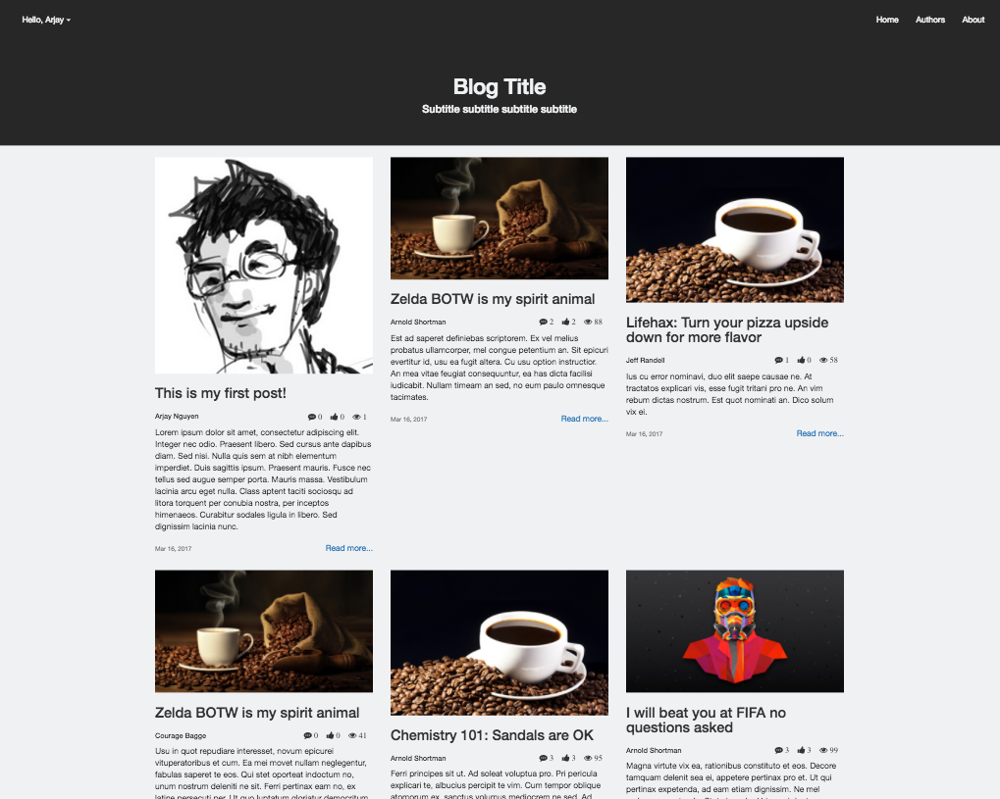

## multi-user-blog

A blogging website built in Python using Google App Engine that allows multiple users to create their own posts to share with other bloggers. They are also able to edit and delete their own posts as they see fit. 

This is project 3 for Udacity's Full Stack Engineer Nanodegree program.

## Install

This project is built on Google App Engine and will require you to install the environment before running. 

https://cloud.google.com/appengine/docs/standard/python/quickstart - Install guide for Google App Engine

Once the environment is installed, simply clone the repo or download the zip file.

# Libraries used 
Bootstrap - CSS Framework
FontAwesome - Icon Font
Isotope - JS Library to make the homepage grid look nicer
Jinja - Template Framework

## Usage

From within the multi-user-blog directory, use the command " dev_appserver.py ." (or use app.yaml instead of .)

## Screenshot of homepage

